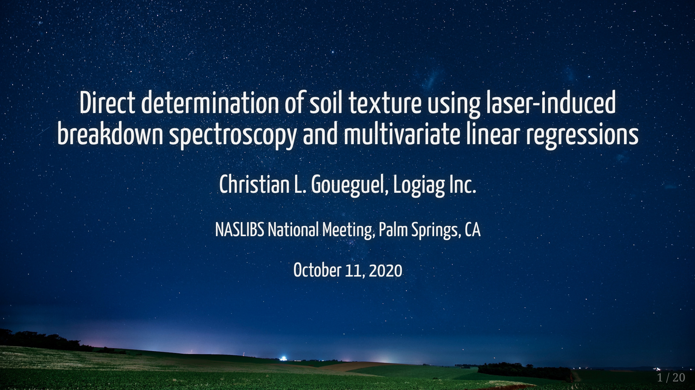

<!-- README.md is generated from README.Rmd. Please edit that file -->

```{r, include = FALSE}
knitr::opts_chunk$set(
  collapse = TRUE,
  comment = "#>",
  fig.path = "man/figures/README-",
  out.width = "100%"
)
```

<!-- badges: start -->

<!-- badges: end -->

## SciX Conference 2019 Slides

Slides presented at the annual meetings of the North American Society for Laser-Induced Breakdown Spectroscopy (NASLIBS) hosted by FACSS SciX Conference 2019 (Palm Springs Convention Center - Palm Springs, CA, USA).

Final Program: <https://www.scixconference.org/resources/Documents/SciX2019FinalProgramWeb.pdf>


